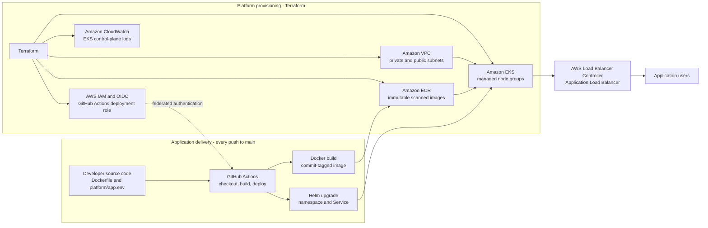

# Platform Engineering on AWS


Self-service developer platform built with Terraform, Jenkins, AWS, Docker, and Infrastructure as Code practices.

[](https://github.com/tukue/terraform-jenkins-aws/actions/workflows/terraform-scan.yml)
[](https://github.com/tukue/terraform-jenkins-aws/actions/workflows/jenkins-platform-delivery.yml)
[](https://github.com/tukue/terraform-jenkins-aws/actions/workflows/backstage-catalog-validation.yml)
[](LICENSE)

---

## Business Problem

Organizations struggle with slow, inconsistent infrastructure delivery — teams wait days or weeks for environments, manual configurations drift from production, and siloed tooling prevents reuse. This repository solves that by providing a **self-service platform engineering foundation** that enables:

- **Speed** — Developers provision infrastructure in minutes via Backstage self-service templates
- **Consistency** — Reusable Terraform modules enforce standardized, compliant infrastructure
- **Reliability** — Automated CI/CD pipelines with security scanning and policy-as-code guardrails
- **Visibility** — Centralized catalog, monitoring, and documentation across all environments

---

## Architecture

```
┌─────────────┐     ┌──────────┐     ┌──────────┐     ┌───────────┐
│  Developer  │────>│  GitHub  │────>│  Jenkins │────>│  Terraform │
└─────────────┘     └──────────┘     └──────────┘     └───────────┘
                                                            │
                                                    ┌────────┴────────┐
                                                    │                 │
                                             ┌──────▼──────┐  ┌──────▼──────┐
                                             │    EC2      │  │    EKS      │
                                             │  Compute    │  │ Container   │
                                             └──────┬──────┘  └──────┬──────┘
                                                    │                 │
                                             ┌──────┴─────────────────┴──────┐
                                             │         Monitoring            │
                                             │  ┌─────┐  ┌──────┐  ┌───────┐│
                                             │  │Prom │  │Graf  │  │CWatch ││
                                             │  └─────┘  └──────┘  └───────┘│
                                             └──────────────────────────────┘
```

### Kubernetes Application Delivery Architecture



Terraform provisions the AWS foundation once per environment. Each application push then uses GitHub Actions and AWS IAM OIDC to build a Docker image, push it to Amazon ECR, deploy it to Amazon EKS with Helm, and verify the rollout. The load balancer path applies only when the application enables ingress.

---

## Developer Experience (DevX)

The platform provides a self-service Kubernetes experience so developers can focus on applications, not cluster operations. EKS clusters are provisioned through a reusable Terraform module at `platform-modules/eks-cluster/` with environment-aware defaults for dev, qa, and prod.

### Application Deployment Recommended Path

The platform now separates application delivery from infrastructure operations. A developer provides only application source code, a Dockerfile, and a small runtime contract generated by Backstage. They do not need to run Terraform, authenticate to ECR manually, create Kubernetes namespaces, write Helm charts, or manage cluster credentials.

| Developer experience | Before the recommended path | With the recommended path |
| :--- | :--- | :--- |
| Onboarding | Manually assemble repository, deployment configuration, and catalog metadata | Use **Create Kubernetes Application** in Backstage to generate the repository contract and catalog entry |
| Application input | Know platform-specific build, registry, and Kubernetes commands | Add source code, Dockerfile, port, and health endpoint |
| Deployment | Coordinate Docker, ECR, kubectl, Helm, and namespace commands | Push to `main` |
| Verification | Inspect cluster state manually | The workflow waits for rollout readiness and prints Service status |
| Platform configuration | Developers handle infrastructure identifiers and access details | Platform team owns EKS, ECR, OIDC, GitHub Actions settings, and Helm defaults |

```text
Developer source code + Dockerfile
        ↓
Backstage-generated platform/app.env
        ↓
git push main
        ↓
GitHub Actions checks out that exact commit
        ↓
Run application tests → build image → generate SBOM → Trivy scan → push to ECR → deploy Helm chart to EKS → verify rollout
```

The generated workflow receives cluster and registry details from platform-managed GitHub Actions settings. `platform/app.env` only describes the application: source path, Dockerfile, test command, port, health path, service exposure, and replica count. See [Kubernetes Application Recommended Path](docs/kubernetes-application-recommended-path.md) for setup and troubleshooting.

### Secure Delivery Gates

Every Backstage-generated Kubernetes application receives these platform-managed controls:

| Control | When it runs | Result |
| :--- | :--- | :--- |
| Application tests | Before AWS authentication | A failed approved `TEST_RUNNER` stops delivery before cloud credentials are available. |
| CycloneDX SBOM | After image build, before vulnerability scan | A 90-day workflow artifact records the packages included in the container image. |
| Trivy image scan | After the Docker build, before ECR push | High or Critical OS and dependency vulnerabilities fail the workflow; the image is not published or deployed. |
| Amazon ECR Enhanced scanning | Continuously after image publication | Amazon Inspector detects newly disclosed vulnerabilities in stored images and keeps findings current; the platform team enables it once per account and Region. |

Developers remediate a failed test or Trivy finding in application code, dependencies, or the base image, then push again. ECR findings provide ongoing visibility for images that were clean when released but become vulnerable later.

### EKS Self-Service Flow

1. **Discover** — Browse the EKS product in the Backstage catalog
2. **Request** — Fill a short scaffolder template (cluster name, region, environment)
3. **Provision** — Terraform creates the cluster with encryption, logging, node groups, and OIDC
4. **Connect** — Run `aws eks update-kubeconfig` or use the `kubeconfig` Terraform output
5. **Deploy** — Use IRSA roles for workload identity — no static credentials needed
6. **Extend** — Add-ons like AWS Load Balancer Controller, cert-manager, and ExternalDNS deploy via IRSA roles the module creates

### What developers get out of the box

- **Managed control plane** — No master node management, automatic patching with EKS-managed updates
- **Encrypted at rest** — KMS-backed envelope encryption for all Kubernetes secrets
- **Continuous image scanning** — Amazon ECR Enhanced scanning re-scans published images through Amazon Inspector
- **Audit logging** — CloudWatch log group with 30–90 day retention by environment (api, audit, authenticator, controllerManager, scheduler)
- **Workload identity** — OIDC provider + IRSA roles for Kubernetes service accounts, EKS Pod Identity Agent add-on
- **Environment-aware sizing** — SPOT instances in dev/qa, ON_DEMAND in prod, tainted system node groups in prod
- **Cluster add-ons** — VPC CNI, CoreDNS, kube-proxy managed through Terraform with version control
- **Modern auth** — EKS Access Entries with access policy associations (replaces legacy aws-auth ConfigMap)
- **Private API endpoint** — Cluster API is private in qa/prod; public access restricted to trusted CIDRs in dev
- **AL2023 node AMI** — Amazon Linux 2023 as the default AMI for all managed node groups
- **Upgrade support** — EXTENDED support enabled for prod clusters

### Platform module capabilities

The `platform-modules/eks-cluster/` module (`platform-examples/eks-cluster/` for a working reference) provisions:

| Component | Detail |
| :--- | :--- |
| **EKS cluster** | Configurable Kubernetes version, authentication mode, endpoint access, encryption config |
| **Managed node groups** | System + application node pools with separate instance families, taints, and scaling limits |
| **IRSA** | OIDC provider + IAM roles for Kubernetes service accounts |
| **AWS Load Balancer Controller** | Optional IRSA role for ingress management |
| **Access management** | EKS Access Entries + access policy associations (cluster/namespace scoped) |
| **Cluster add-ons** | VPC CNI, CoreDNS, kube-proxy, Pod Identity Agent with configurable versions and conflict resolution |
| **Control plane logging** | All log types with configurable CloudWatch retention |
| **Security groups** | Additional security group IDs for cluster API access |
| **Encryption** | KMS key ARN for envelope encryption of Kubernetes secrets |
| **Upgrade support** | STANDARD or EXTENDED support type per environment |

### Environment defaults

| Setting | dev | qa | prod |
| :--- | :--- | :--- | :--- |
| Node capacity | SPOT | SPOT | ON_DEMAND |
| API endpoint | Public (restricted CIDR) | Private | Private |
| Upgrade support | STANDARD | STANDARD | EXTENDED |
| Log retention | 30 days | 30 days | 90 days |
| Node groups | system + application | system + application | system (tainted) + application |

---

## Design Considerations

| Principle | Decision | Trade-off |
|:---|:---|:---|
| **IaC Tooling** | Terraform over CloudFormation/CDK | Larger state management overhead, but broader multi-provider support and stronger community module ecosystem |
| **CI/CD Orchestrator** | Jenkins + GitHub Actions dual pipeline | More moving parts to maintain, but enables complex pipeline orchestration with Jenkins while keeping lightweight validation in GitHub Actions |
| **Module Architecture** | Productized platform modules over monolithic stacks | Higher initial abstraction cost, but enables reuse across teams and consistent golden path deployments |
| **Security Posture** | Private subnets + WAF + IAM least privilege by default | Increased networking complexity (NAT gateways, VPC endpoints), but reduces attack surface and meets compliance requirements |
| **Environment Isolation** | Separate tfvars/backend per environment (dev/qa/prod) | Configuration duplication, but clear promotion path and blast radius containment |
| **State Management** | Remote S3 + DynamoDB locking | Dependency on additional AWS infrastructure, but prevents concurrent corruption and enables team collaboration |
| **Developer Portal** | Backstage over custom portal | Requires Backstage deployment and maintenance, but provides rich plugin ecosystem and industry-standard developer experience |
| **Policy Enforcement** | OPA/Conftest shift-left validation | Gate policy at plan-time only (not runtime), but catches violations before resources are provisioned |

---

## Features

- **Reusable Terraform modules** — Productized building blocks in `platform-modules/`
- **Automated Jenkins provisioning** — Standardized CI/CD infrastructure
- **CI/CD pipelines** — GitHub Actions + Jenkins for end-to-end automation
- **Infrastructure automation** — Terraform with remote state, environments, and modules
- **Environment standardization** — Dev, QA, Prod with consistent configs
- **Observability & monitoring** — Prometheus, Grafana, CloudWatch integration
- **Secure cloud architecture** — IAM least privilege, WAF, VPC isolation
- **GitOps-ready workflows** — Backstage catalog integration with scaffolder templates
- **EKS cluster provisioning** — Managed Kubernetes with node groups, IRSA, encryption, and add-ons

---

## Terraform Operating Model

- `bootstrap/remote-state/` creates the shared S3, KMS, and DynamoDB backend foundation.
- `live/dev`, `live/qa`, and `live/prod` are explicit environment roots with separate backend keys.
- `platform-modules/jenkins-platform/` composes the Jenkins network, security, compute, edge, and observability modules.

See [docs/live-environments.md](docs/live-environments.md) for bootstrap, local plan, and CI/CD usage.

---

## Platform Engineering Capabilities

| Capability | Implementation |
| :--- | :--- |
| **Infrastructure as Code** | Terraform modules, remote state, environment-specific configs |
| **CI/CD Automation** | GitHub Actions + Jenkins pipeline orchestration |
| **Developer Self-Service** | Backstage portal with golden path templates |
| **Standardized Deployments** | Reusable platform-modules with versioning |
| **Cloud Governance** | OPA policy-as-code for tags, cost, security |
| **Secure Secrets Management** | Vault integration, scoped IAM roles |
| **Environment Provisioning** | Dev/QA/Prod with isolated accounts and VPCs |
| **Kubernetes Runtime** | EKS cluster with managed node groups, IRSA, KMS encryption, and cluster add-ons |
| **Developer Self-Service for K8s** | Backstage scaffolder template creates a fully-configured EKS cluster with RBAC-ready IRSA roles |
| **Observability** | Prometheus + Grafana dashboards + CloudWatch alarms |

---

## Architecture Overview

The platform is structured around productized infrastructure modules:

| Layer | Components |
| :--- | :--- |
| **Network** | VPC, subnets, NAT gateways, flow logs, transit gateway |
| **Security** | Security groups, WAF, IAM policies, KMS encryption |
| **Compute** | EC2 (Jenkins), EKS (containers), Auto Scaling |
| **Edge** | ALB, target groups, listeners, SSL termination |
| **Observability** | Prometheus, Grafana, CloudWatch metrics & alarms |
| **CI/CD** | Jenkins server, GitHub Actions, pipeline as code |

---

## Deployment Workflow

1. **Developer** pushes code to GitHub
2. **GitHub Actions** triggers validation (lint, format, security scan)
3. **Jenkins** picks up the validated change
4. **Terraform** plans and applies infrastructure changes
5. **AWS** resources are provisioned (EC2, EKS, networking)
6. **Monitoring** stack is configured with alerts and dashboards
7. **Backstage** catalog is updated with new component metadata

---

## Security

- **IAM least privilege** — Scoped roles per service, no wildcard permissions
- **Secrets management** — HashiCorp Vault integration for sensitive data
- **CI/CD pipeline scanning** — Security scans in GitHub Actions + Jenkins
- **Infrastructure validation** — `terraform validate`, `tflint`, `checkov`, OPA policies
- **Network isolation** — VPC segmentation, private subnets, security groups
- **Encryption** — KMS for EBS, S3, and RDS encryption at rest

---

## Monitoring

| Tool | Purpose |
| :--- | :--- |
| **Prometheus** | Metrics collection and alerting rules |
| **Grafana** | Dashboards for infrastructure and application metrics |
| **CloudWatch** | Log aggregation, metric filters, and alarms |
| **AlertManager** | Incident notification routing |

---

## Reliability

- **Automated deployments** — Fully automated provisioning via CI/CD pipelines
- **Repeatable infrastructure** — Terraform modules with deterministic state management
- **Immutable infrastructure** — No manual server changes; rebuild from code
- **Rollback-ready** — Terraform state versioning in S3 with DynamoDB locking
- **Multi-AZ** — Resources distributed across availability zones
- **Health checks** — ALB target group health checks with auto-remediation

---

## Disaster Recovery

| Scenario | Strategy |
| :--- | :--- |
| **State loss** | Remote state in S3 with versioning + DynamoDB locking |
| **Region failure** | Multi-region capability via Terraform workspaces |
| **Data loss** | RDS automated backups, S3 versioning, EBS snapshots |
| **Jenkins failure** | AMI-backed EC2 with startup provisioning script |
| **Credential compromise** | Vault dynamic secrets with automatic rotation |

---

## Scaling Strategy

- **Horizontal scaling** — Auto Scaling Groups for EC2, EKS node groups for containers
- **Vertical scaling** — Instance type selection based on workload profiling
- **State scaling** — Terraform workspaces for environment isolation
- **Pipeline scaling** — Jenkins controller/agent architecture with dynamic agents
- **Observability scaling** — Prometheus federation for multi-cluster monitoring

---

## Repository Structure

```bash
├── docs/                  # Product docs, architecture, and runbooks
├── platform-modules/      # Reusable infrastructure building blocks
│   ├── network/           # VPC, subnets, routing, NAT, flow logs
│   ├── security/          # Security groups, IAM, WAF
│   ├── compute/           # EC2, EKS compute modules
│   ├── eks-cluster/       # EKS cluster, node groups, IRSA, OIDC, add-ons
│   └── edge/              # ALB, listeners, target groups, WAF
├── platform-examples/     # Example consumption patterns
├── templates/             # Backstage Scaffolder templates
├── backstage-app/         # Local Backstage portal assets
├── jenkins/               # Jenkins product implementation
├── networking/            # Shared VPC and networking
├── observability-service/ # Metrics, logs, and dashboards
├── policies/              # OPA policy-as-code rules
├── vault-service/         # Vault integration for secrets
└── grafana/               # Grafana dashboards and datasources
```

---

## Quick Actions

| Action | Link |
| :--- | :--- |
| View Roadmap | [Implementation Backlog](IMPLEMENTATION-BACKLOG.md) |
| Getting Started | [Platform Onboarding Guide](docs/getting-started.md) |
| Architecture Deep Dive | [Architecture Guide](docs/architecture.md) |
| Deployment Guide | [DEPLOYMENT-GUIDE.md](DEPLOYMENT-GUIDE.md) |
| Contribution Standards | [CONTRIBUTING.md](CONTRIBUTING.md) |
| Quality Gate | `make quality` |
| Local Portal | `make local-up` (requires Docker) |

---

> **Note**: This is a showcase repository demonstrating platform engineering maturity. It is designed for reference and learning — not as a 1:1 copy-paste for production without proper hardening.
