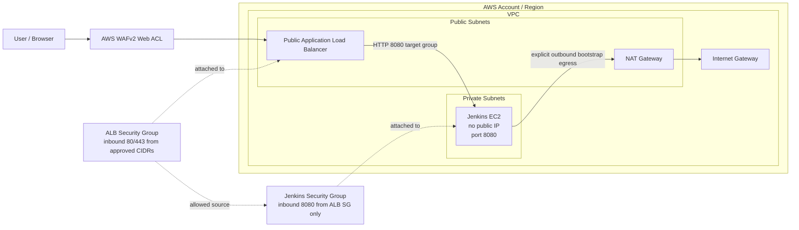

# Platform Architecture

This document describes the repository as a platform architecture, not just as a set of Terraform files.

The architecture is centered on two product tracks:

- `Jenkins on AWS`
- `Customer ECS Runtime`

These tracks share a common platform foundation made up of reusable Terraform modules, environment-aware configuration, platform standards, and supporting operational documentation.

## Architecture Intent

The architecture in this repository is designed to show how infrastructure capabilities can be packaged as a platform product.

The key design goals are:

- reusable platform building blocks instead of one-off stacks
- clear product boundaries for Jenkins and ECS runtime delivery
- environment-aware delivery across `dev`, `qa`, and `prod`
- visible guardrails, documentation, and ownership
- a repo structure that supports platform evolution rather than isolated infra work

## Product-Level View

The repository has two main product paths.

### Jenkins on AWS

This path provides a standardized infrastructure baseline for Jenkins on AWS.

At a high level it combines:

- networking
- security groups
- load balancing
- WAF protection for the public entry point
- certificates and DNS
- Jenkins compute and supporting configuration
- environment-specific Terraform inputs and backend configuration

#### Adding private subnet, ALB, WAF 

Think of the Jenkins platform path as three separate planes:

- The entry plane is public. Users reach Jenkins through an internet-facing Application Load Balancer. AWS WAF is attached to that ALB, so common application-layer threats and abusive request rates are handled before traffic reaches the VPC workload.
- The runtime plane is private. The Jenkins EC2 instance lives in private subnets, has no public IP address, and only accepts port `8080` from the ALB security group.
- The egress plane is outbound-only and explicit. By default, Jenkins security group egress is VPC-only for tfsec compliance. If bootstrap needs public package or plugin endpoints, operators must intentionally set `allowed_jenkins_egress_cidr_blocks` or use private mirrors and VPC endpoints.

This means the public surface is the ALB plus WAF, not the Jenkins server. Security groups express that boundary: HTTP/HTTPS is allowed to the ALB only from approved CIDR blocks, and Jenkins application traffic is allowed only from the ALB to the private instance.

#### Infrastructure Diagram

The optional HTTPS path depends on `alb_certificate_arn`. When a certificate ARN is provided, the ALB redirects HTTP to HTTPS and forwards HTTPS traffic to Jenkins over HTTP on port `8080` inside the VPC. Without a certificate ARN, the ALB serves HTTP and still keeps Jenkins private.

### Customer ECS Runtime

This path provides a reusable runtime baseline for customer or tenant-oriented workloads on ECS.

At a high level it combines:

- reusable ECS runtime modules
- environment-aware runtime configuration
- customer-runtime examples and templates
- CI/CD and image delivery assumptions
- runtime guardrails for tagging, IAM scope, and deployment structure

## Shared Platform Foundation

The two product tracks depend on the same shared platform layers.

### Reusable Terraform Modules

The repository packages infrastructure patterns into reusable units rather than scattering the logic across unrelated stacks.

The shared building blocks include areas such as:

- networking
- load balancing
- certificates and DNS
- security groups
- Jenkins infrastructure
- customer ECS runtime infrastructure

These building blocks live across the root modules and the reusable paths under `platform-modules/`.

### Environment Model

The platform uses explicit environment configuration for:

- `dev`
- `qa`
- `prod`

This is represented through:

- dedicated tfvars files
- dedicated backend config files
- promotion-aware delivery expectations

The intent is to make environment structure part of the product contract rather than an afterthought.

### Standards and Governance

The architecture assumes the platform is not only provisioned, but also governed and documented.

That includes:

- platform standards
- documentation as part of the product surface
- baseline validation and linting expectations
- ownership and support boundaries for the shared platform layer

### Operational Support Layer

The repository includes supporting operational assets such as:

- runbooks
- observability-related components
- local Vault support
- local platform evaluation flow

These improve the architecture by making the platform easier to review and operate, even where production maturity is still incomplete.

## Repository Structure As Architecture

The repository structure itself reflects the platform architecture.

| Path | Architectural Role |
|---|---|
| `platform-modules/` | Reusable shared platform building blocks |
| `platform-modules/network/` | Jenkins VPC, subnets, routing, NAT, flow logs, and network ACLs |
| `platform-modules/security/` | Jenkins and ALB security group boundaries |
| `platform-modules/compute/` | Jenkins EC2 compute and bootstrap boundary |
| `platform-modules/edge/` | Jenkins ALB, target group, listeners, and WAF boundary |
| `platform-examples/` | Example product-aligned implementations |
| `templates/` | Self-service entry points and standard product inputs |
| `jenkins/` | Jenkins-specific infrastructure product path |
| `docs/` | Product, architecture, governance, and operations layer |
| `observability-service/` | Supporting observability assets for platform evaluation |
| `vault-service/` | Supporting secret workflow evaluation assets |

## Delivery Architecture

The platform is designed around a delivery flow where shared infrastructure patterns are validated, parameterized by environment, and then applied through a standard path.

The intended delivery shape is:

1. choose the correct product path
2. start from the documented baseline
3. select the target environment
4. validate Terraform and product inputs
5. plan and apply through the expected delivery path
6. operate within the documented support and governance boundaries

This is why the architecture should be read together with the product docs, not as an isolated infrastructure diagram.

## Security and Operability Position

The architecture already includes real platform concerns:

- scoped IAM patterns
- tagging and environment defaults
- logging and observability building blocks
- security scanning and validation in the delivery workflow

But the current platform still has clear maturity limits:

- policy enforcement is not yet strong across all paths
- tracing is not implemented as a standard capability
- drift detection is not implemented
- full enterprise governance and approval flows are not yet part of the baseline

These limits should be stated directly whenever the repo is presented.

## What This Architecture Is Good At

This architecture is strongest when presented as:

- a platform engineering foundation
- a productized infrastructure reference implementation
- a consulting-friendly platform-as-product example
- a repo that combines Terraform, delivery patterns, and platform documentation into one coherent surface

## What This Architecture Is Not

This architecture should not be presented as:

- a finished enterprise internal developer platform
- a fully production-hardened multi-runtime platform
- a complete governance and policy enforcement solution

## Related Docs

- [Getting Started](./getting-started.md)
- [Platform Golden Paths](./platform-golden-paths.md)
- [Platform Operating Model](./platform-operating-model.md)
- [Platform-as-a-Product Implementation Status](./platform-as-product-implementation-status.md)
- [Best Practices](./best-practices.md)
