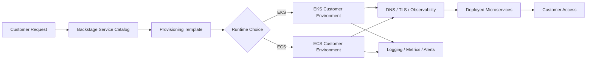

# Multi-Tenant Customer Runtime Design

## Purpose

This document describes a business scenario where a microservice-based application runs on AWS and each customer receives a dedicated runtime environment provisioned through a self-service platform.

The platform should be able to provision either:

- Amazon EKS for customers that need Kubernetes
- Amazon ECS for customers that want a simpler container platform

The goal is to make customer onboarding smooth, repeatable, secure, and visible through Backstage.

---

## Business Scenario

The company operates a SaaS platform built from microservices on AWS.

Some customers require:

- Strong isolation from other customers
- Dedicated scaling and capacity
- Custom network or security controls
- Auditability for compliance
- Independent upgrades or release timing

Instead of engineering manually creating environments for each customer, the platform provides a standardized onboarding workflow.

Each new customer environment is created from a template and registered in the platform catalog.

---

## Product Goals

- Provision customer environments consistently
- Support both EKS and ECS runtime models
- Reduce manual platform work
- Keep customer-specific environments observable and supportable
- Make provisioning traceable through the platform catalog
- Allow the platform to evolve without redesigning onboarding every time

---

## Non-Goals

- Building a fully custom per-customer control plane
- Supporting every possible runtime model
- Hand-managing customer infrastructure
- Requiring platform engineers to create each environment manually

---

## Key Users

- Customer success teams who request new environments
- Platform engineers who maintain templates and guardrails
- Application teams who deploy microservices
- Operations teams who monitor and support the environments

---

## High-Level Architecture

---

## Provisioning Flow

1. A customer onboarding request is created.
2. The operator selects the runtime type: EKS or ECS.
3. The platform template collects customer-specific inputs.
4. Terraform provisions the AWS resources.
5. Backstage registers the new environment in the catalog.
6. CI/CD deploys the microservices.
7. Monitoring, logs, and alerts are attached automatically.
8. The customer receives access to their dedicated runtime.

---

## Runtime Options

### Option 1: Dedicated EKS per customer

Use this when the customer needs Kubernetes features or stronger platform flexibility.

#### Strengths

- Strong isolation model
- Kubernetes ecosystem support
- Good fit for complex microservice platforms
- Easier to support portable workloads
- Flexible ingress, policy, and workload controls

#### Tradeoffs

- Higher operational complexity
- More cluster management overhead
- More expensive for small customers

### Option 2: Dedicated ECS per customer

Use this when the customer wants a simpler container runtime and does not need Kubernetes.

#### Strengths

- Lower operational overhead
- Faster to provision
- Simpler to manage
- Good fit for standardized workloads

#### Tradeoffs

- Less flexibility than Kubernetes
- Smaller ecosystem for platform extensions
- Harder to support Kubernetes-specific customer needs later

---

## Decision Table

| Need | EKS | ECS |
|------|-----|-----|
| Strong Kubernetes support | Best | Not ideal |
| Simpler operations | Medium | Best |
| Fast provisioning | Medium | Best |
| Advanced platform extensibility | Best | Medium |
| Lower ops cost | Medium | Best |
| Standardized microservices | Best | Best |
| Enterprise customization | Best | Medium |

### Recommendation

- Use **EKS** for customers that need advanced controls, custom policies, or Kubernetes compatibility
- Use **ECS** for customers that want a lighter-weight runtime with faster onboarding
- Expose both through the same platform workflow so the business can choose the right runtime per customer

---

## Customer Isolation Model

The platform should support clear isolation boundaries.

### Recommended isolation levels

- Dedicated AWS account per customer for high-isolation or regulated customers
- Dedicated VPC per customer for medium isolation
- Shared account with separate namespaces or services only for low-risk use cases

### Isolation controls

- Separate IAM roles
- Separate network policies
- Separate DNS zones or subdomains
- Separate secrets and configuration
- Separate logs and dashboards
- Separate cost tracking

---

## Platform Components

### Shared platform services

- Backstage catalog
- Terraform execution pipeline
- Identity and access management
- DNS and certificate automation
- Observability stack
- Shared templates and runbooks

### Customer-specific services

- Runtime environment
- Load balancers or ingress
- Namespaces or services
- Customer-specific database or cache if required
- Customer-specific secrets and configuration

---

## Backstage Experience

Backstage should be the front door for customer environment provisioning.

### Catalog entities

- `System`: `customer-platform`
- `Component`: `customer-onboarding`
- `Component`: `eks-runtime`
- `Component`: `ecs-runtime`
- `Resource`: `customer-environment`
- `Resource`: `customer-dns`
- `Resource`: `customer-observability`

### What the user sees

- Customer environment catalog entries
- Template to provision a new customer runtime
- Links to runbooks and architecture docs
- Ownership and support details
- Health and telemetry links

---

## Terraform Module Strategy

The platform should use reusable modules so each customer environment can be composed from the same building blocks.

### Common modules

- network
- security groups
- IAM roles
- DNS
- certificate management
- observability
- runtime provisioning

### EKS-specific modules

- cluster
- node groups
- IRSA
- ingress controller
- external DNS
- cert-manager

### ECS-specific modules

- ECS cluster
- task definitions
- service definitions
- load balancer integration
- service discovery

---

## Operational Model

### Provisioning

- Everything must be created from code
- Templates should enforce naming and tagging standards
- Production customer environments should require approval

### Monitoring

- Every customer environment should have logs and metrics
- Every environment should have a support contact and owner
- Every deployment should be traceable

### Lifecycle

- Create
- Update
- Scale
- Reconfigure
- Decommission

---

## Risks

- Customer-per-environment designs can become expensive
- Too much customization can reduce platform consistency
- EKS can be operationally heavy if overused
- ECS can be limiting if customers later need Kubernetes
- Poor catalog hygiene can make the platform hard to trust

The main mitigation is to keep a small set of supported patterns and clear guardrails.

---

## Success Criteria

The platform is working if it can show:

- Faster customer onboarding
- Fewer manual platform tickets
- Clear ownership for every customer runtime
- Reliable provisioning through templates
- Good observability and support readiness
- A runtime choice that matches business needs

---

## Recommendation

Use Backstage and Terraform to offer a standard customer onboarding product with two runtime options:

- **EKS** for customers who need Kubernetes and advanced flexibility
- **ECS** for customers who want faster, simpler provisioning

This gives the business a clean multi-tenant platform strategy that can grow over time without reworking the entire system.
