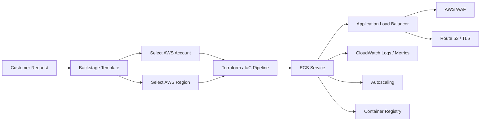

# SaaS E-Commerce ECS Platform Design

## Purpose

This document describes how to evolve the platform into a self-service AWS ECS runtime for a SaaS e-commerce application.

The goal is to make it easy to provision scalable container infrastructure in the AWS account and region closest to the customer, while keeping the platform secure, observable, and simple to operate.

The intended customer-facing inputs are deliberately small:

- AWS account
- AWS region

Everything else should be handled by platform defaults, templates, and shared infrastructure patterns.

---

## Business Scenario

The application is a multi-tenant SaaS e-commerce platform hosted on AWS.

It serves storefronts, product APIs, checkout flows, order processing, and customer portals. Different customers or brands may need separate runtime placement for:

- latency-sensitive storefront traffic
- regional data residency
- burst scaling during campaigns and sales
- operational isolation
- different release timing or support boundaries

ECS is the preferred runtime because it provides a strong balance of scale, operational simplicity, and integration with AWS-native load balancing, security, and observability.

---

## Product Goals

- Provision ECS-based runtime environments quickly
- Keep the customer-facing setup minimal
- Let the customer choose the AWS account and region
- Scale easily for e-commerce traffic spikes
- Attach security controls by default
- Expose the runtime in Backstage
- Make each environment observable and supportable

---

## Non-Goals

- Building a custom orchestration platform
- Requiring customers to understand the full AWS stack
- Forcing Kubernetes on every workload
- Handcrafting environments outside the platform workflow

---

## Recommended Runtime Model

### Default model: ECS per customer or brand environment

Use ECS when the business wants:

- faster onboarding
- predictable scaling
- simpler runtime operations than Kubernetes
- strong AWS integration

### Optional model: shared ECS cluster with isolated services

Use this for smaller customers or lower-cost environments.

### Premium model: dedicated account and region

Use this for high-isolation or regulated customers that need strong separation.

---

## High-Level Architecture

---

## Provisioning Flow

1. A platform user requests an environment for the SaaS e-commerce app.
2. The user selects the AWS account and AWS region.
3. The platform fills in the rest from approved defaults.
4. Backstage creates or links the customer runtime repository.
5. Terraform provisions the ECS runtime, networking, load balancing, WAF, DNS, and observability.
6. The application pipeline builds and pushes the container image.
7. ECS deploys the service.
8. The runtime is registered in Backstage.
9. Dashboards, logs, and runbooks are attached automatically.

---

## Minimal Customer Inputs

The customer-facing configuration should stay small:

- `aws_account_id`
- `aws_region`

Optional advanced inputs may exist for platform admins, but they should not be required for the standard path.

---

## Why ECS Fits E-Commerce

ECS is a strong fit for SaaS e-commerce workloads because:

- storefront and API traffic scale horizontally
- application containers are typically stateless
- ALB handles traffic distribution well
- WAF helps protect login, cart, and checkout flows
- autoscaling can respond to promotions and seasonal demand
- the operational model is simpler than a Kubernetes-first platform

---

## Core Platform Components

### Shared services

- Backstage catalog and templates
- Terraform execution pipeline
- AWS IAM and access control
- Route 53 and certificates
- CloudWatch logs, metrics, and alarms
- WAF and security guardrails
- Container registry integration

### Runtime services

- ECS cluster or service
- Task definitions
- Application Load Balancer
- Target groups and listeners
- Autoscaling policies
- Optional Redis/cache
- Optional database

### Application services

- storefront API
- checkout service
- order service
- catalog/search service
- customer portal

---

## Backstage Experience

Backstage should act as the front door for environment creation and runtime discovery.

### What users see

- a template to provision the runtime
- the selected AWS account and AWS region
- the runtime status
- operational dashboards
- logs and alerts
- runbooks for incidents and scaling

### Catalog entities

- `System`: `saas-ecommerce-platform`
- `Component`: `ecs-runtime`
- `Component`: `customer-onboarding`
- `Resource`: `checkout-service`
- `Resource`: `storefront-service`
- `Resource`: `platform-observability`

---

## ECS Runtime Design

Each runtime should include:

- ECS cluster or shared ECS namespace pattern
- task definitions for the app services
- ALB for public traffic
- WAF in front of the ALB
- CloudWatch logging
- autoscaling rules
- DNS and TLS
- security groups and least-privilege IAM

The platform should assume the app is containerized and ready to deploy via image tag.

---

## Scaling Strategy

The platform must support growth in traffic and customer count.

### Application scaling

- scale ECS tasks on CPU
- scale ECS tasks on memory
- scale ECS tasks on request count
- use stateless services where possible

### Traffic handling

- use ALB for request routing
- use WAF for application-layer protection
- use caching where appropriate
- use regional placement to reduce latency

### Operational scaling

- keep the runtime template standardized
- version the platform modules
- avoid one-off infrastructure paths
- support repeatable deployment across regions and accounts

---

## Security Model

- Use IAM task roles instead of shared credentials
- Store secrets in AWS Secrets Manager or Parameter Store
- Put WAF in front of public endpoints
- Use TLS for all public traffic
- Restrict security groups to least privilege
- Separate environments by account when needed
- Tag everything for ownership and cost tracking

---

## Observability Model

Each runtime should be visible from day one:

- CloudWatch logs for applications and platform services
- CloudWatch metrics for ECS, ALB, and scaling
- alarms for service health and deployment failures
- dashboards for support and operations
- optional traces for request-level debugging

---

## Cost Model

The platform should support chargeback or showback.

Recommended tags:

- `Customer`
- `Environment`
- `Service`
- `Owner`
- `AWSRegion`
- `AWSAccount`
- `ManagedBy`

This allows the business to understand:

- which customers cost the most
- which regions are most expensive
- where traffic spikes are happening
- which services need right-sizing

---

## Terraform Module Strategy

The platform should use reusable modules so the e-commerce runtime can be repeated safely.

### Foundation modules

- network
- security groups
- IAM roles
- DNS
- certificates
- WAF
- logging

### Runtime modules

- ECS cluster
- ECS service
- task definition
- load balancer
- target group
- autoscaling

### Optional modules

- database
- cache
- preview environments
- blue/green deployment support

---

## Operational Model

### Platform team owns

- templates
- Terraform modules
- scaling rules
- security defaults
- Backstage catalog entries

### Application team owns

- container images
- service behavior
- deployment readiness
- feature flags and runtime config

### Support team owns

- incident response
- customer communication
- runbooks
- service health checks

---

## Implementation Phases

### Phase 1: Basic ECS runtime

- provision ECS service, ALB, and WAF
- require only account and region from the user
- attach logging and dashboards

### Phase 2: E-commerce deployment flow

- add ECR image publishing
- add deployment automation
- add autoscaling policies
- add WAF tuning guidance

### Phase 3: Multi-region support

- allow per-region customer placement
- support regional defaults and tagged cost reporting
- make Backstage the discovery layer for all regions

### Phase 4: Premium platform features

- blue/green deployments
- per-customer isolation modes
- cache/database templates
- multi-account governance

---

## Risks

- too much customization can make the platform hard to maintain
- a shared cluster can become noisy without good guardrails
- poor region selection can increase latency
- missing deployment automation can leave ECS as “infrastructure only”

The best mitigation is a small set of opinionated, well-documented paths.

---

## Success Criteria

The platform is successful if:

- a user can provision an ECS runtime with only account and region decisions
- the runtime deploys cleanly in the chosen AWS region
- the app can scale for promotions and traffic spikes
- the runtime is visible in Backstage
- support can find logs, metrics, and runbooks quickly

---

## Recommendation

Use ECS as the standard runtime for the SaaS e-commerce platform, make AWS account and AWS region the only customer-facing placement inputs, and let the platform handle the rest through defaults, modules, and Backstage templates.
