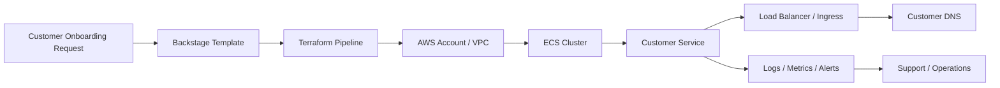
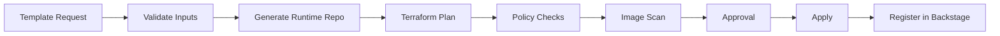

# Multi-Tenant ECS Provisioning Implementation

## Purpose

This document defines how to implement customer-specific runtime provisioning on AWS ECS for a microservice-based application.

The platform should let a customer request a dedicated ECS environment through a self-service workflow, then provision the required AWS resources consistently with Terraform and Backstage.

This design focuses on the ECS path only.

---

## Problem Statement

The company runs a microservice application on AWS and needs to onboard multiple customers with predictable, isolated runtimes.

Manually creating ECS environments for each customer does not scale because it introduces:

- Slow onboarding
- Inconsistent configuration
- Higher support overhead
- Security and compliance risk
- Difficult lifecycle management

The solution is to provide a repeatable ECS provisioning workflow that can be used per customer.

---

## Goals

- Provision an ECS runtime for each customer through a standard workflow
- Support tenant isolation and repeatability
- Integrate provisioning with Backstage
- Keep customer environments observable and supportable
- Make the platform easy to extend later
- Make the customer-facing provisioning step as small as possible by asking only for AWS account and AWS region for placement

---

## Non-Goals

- Replacing all AWS services
- Building a custom container orchestrator
- Using Kubernetes for this implementation
- Creating a fully bespoke customer environment by hand

---

## Target Model

The recommended model is a **customer-dedicated ECS environment** that can be provisioned from a standard template.

This can be implemented in one of three ways:

### Option A: Dedicated ECS cluster per customer

Best for customers that need stronger isolation or separate lifecycle control.

### Option B: Shared ECS cluster with isolated services per customer

Best for lower-cost onboarding and simpler operations.

### Option C: Dedicated AWS account and ECS cluster per customer

Best for high-compliance or high-isolation customers.

### Recommendation

Use **Option B** as the default implementation path for the first version, then support **Option A** or **Option C** for premium or regulated customers.

---

## High-Level Architecture



---

## Core Provisioning Flow

1. A customer requests a new environment.
2. The operator chooses the runtime type and isolation level.
3. Backstage asks the customer for only the AWS account and AWS region.
4. The customer selects the region closest to their users or matching their residency constraints.
5. A repository is created for the new customer runtime.
6. Terraform provisions the network, ECS cluster, ECR repository, IAM, logging, and load balancing in that account and region.
7. CI/CD builds the application image, scans it for HIGH and CRITICAL vulnerabilities, and pushes it to ECR only if the scan passes.
8. CI/CD deploys the customer microservices from the approved image.
9. The environment is registered in Backstage.
10. Monitoring and support links are attached automatically.

### Minimal customer inputs

The platform should keep the customer-facing input set small:

- `aws_account_id`
- `aws_region`

All other runtime inputs should be prefilled by platform defaults where possible.

---

## ECS Resource Model

Each customer environment should include:

- ECS cluster
- Task definitions
- ECS services
- IAM roles for tasks
- Load balancer integration
- Security groups
- DNS entry or subdomain
- CloudWatch logging
- Autoscaling rules for CPU, memory, and ALB request load

If the customer needs a database or cache, those should be provisioned as separate resources and linked to the runtime.

---

## Multi-Tenant Isolation Strategy

### Default isolation: service-level isolation in a shared cluster

Use separate ECS services for each customer:

- Separate task definitions
- Separate secrets
- Separate environment variables
- Separate ALB listener rules or target groups
- Separate namespaces in the catalog and observability views

### Strong isolation: cluster-per-customer

Use this for customers with higher compliance or support requirements.

### Highest isolation: account-per-customer

Use this for enterprise customers that require strict separation of billing, permissions, and network boundaries.

---

## Backstage Integration

Backstage should be the portal for requesting and tracking customer ECS environments.

### Catalog entries

- `System`: `customer-platform`
- `Component`: `ecs-customer-runtime`
- `Component`: `customer-onboarding`
- `Resource`: `customer-ecs-cluster`
- `Resource`: `customer-service`
- `Resource`: `customer-dns`

### User journey

1. Search the catalog
2. Select the customer onboarding template
3. Enter customer details
4. Choose isolation level
5. Provision the runtime
6. View docs and operational links in the catalog

---

## Terraform Module Plan

The ECS implementation should be split into reusable modules.

### Foundation modules

- VPC and subnets
- Security groups
- IAM roles and policies
- Route 53
- ACM certificates
- S3 backend

### ECS modules

- ECS cluster
- ECS service
- Task definition
- ECR repository
- Load balancer target group
- Autoscaling
- Logging configuration

### Customer-specific modules

- Customer DNS
- Customer secrets
- Customer database
- Customer cache
- Customer observability

---

## Recommended Terraform Structure

```text
terraform/
  ecs/
    cluster/
    service/
    task-definition/
    load-balancer/
    dns/
    observability/
  customer/
    account/
    network/
    onboarding/
```

This structure keeps shared platform logic separate from customer-specific resources.

---

## Service Deployment Strategy

The platform should support a standard deployment pipeline:

- Source code pushed to GitHub
- Build pipeline creates the container image
- Image pushed to a registry
- Terraform or deployment automation updates the ECS service
- Service is verified by health checks
- Autoscaling policies are attached automatically

For customer environments, every deployment should be tied to the customer identifier so the runtime is traceable.

---

## Observability Requirements

Each customer environment should have:

- CloudWatch logs
- Service health checks
- CPU and memory metrics
- ALB request metrics
- Alerting for failures
- Dashboards for support teams

Optional:

- OpenTelemetry traces
- Customer-specific dashboards
- Cost allocation by customer

---

## Security Requirements

- Use IAM task roles instead of shared credentials
- Store secrets in AWS Secrets Manager or Parameter Store
- Enforce least privilege for runtime roles
- Restrict network access with security groups
- Use TLS for public endpoints
- Separate production and non-production environments
- Tag everything with customer and environment metadata

## DevSecOps Principles

The ECS provisioning workflow should embed security and compliance throughout the delivery path:

- use policy as code for infrastructure and template guardrails
- scan container images before they are promoted to ECS
- validate Terraform plans and module inputs in CI before apply
- keep secrets out of source control, templates, and generated repos
- require minimal IAM permissions for Backstage, deployment pipelines, and tasks
- enable WAF, logging, and alerting by default for every public runtime
- make ownership explicit through Backstage catalog entities and tags
- keep an auditable trail of who requested, approved, and provisioned each runtime
- document security operations, false-positive handling, and incident response
- design for secure defaults first, then allow controlled overrides for advanced cases

## Security Gate Flow



The provisioning pipeline should stop when:

- the requested account or region is invalid
- Terraform plan validation fails
- policy-as-code checks fail
- image scanning identifies critical findings
- security ownership or audit metadata is missing

## Security Checklist

The generated runtime repository should include a short checklist confirming:

- image scan completed
- secrets stored in AWS Secrets Manager or Parameter Store
- WAF enabled for public traffic
- least-privilege IAM reviewed
- runtime tags and catalog entry created
- monitoring and alerting configured

---

## Cost Model

The platform should support cost visibility per customer.

Recommended tags:

- `Customer`
- `Environment`
- `Service`
- `Owner`
- `ManagedBy`

This makes it possible to:

- Track cost per customer
- Support chargeback or showback
- Identify expensive workloads
- Tune cluster sizing and service scaling

---

## Operational Model

### Platform team owns

- Templates
- Terraform modules
- ECS cluster standards
- Runtime guardrails
- Documentation

### Application team owns

- Customer service code
- Container image
- Service-level configuration
- Deployment readiness

### Support team owns

- Incident response
- Customer communication
- Escalation paths
- Runbook usage

---

## Implementation Phases

### Phase 1: Shared ECS foundation

- Add ECS Terraform modules
- Add networking and IAM foundations
- Add logging and health checks
- Add one sample customer runtime

### Phase 2: Self-service onboarding

- Add Backstage template
- Add catalog entries
- Add customer input forms
- Add deployment automation

### Phase 3: Tenant lifecycle

- Add update and scale workflows
- Add decommission workflow
- Add support runbooks
- Add cost tagging

### Phase 4: Premium isolation options

- Add cluster-per-customer mode
- Add account-per-customer mode
- Add compliance and audit controls

---

## Risks

- Shared cluster designs can become noisy if not properly isolated
- Per-customer environments can increase cost
- Too many runtime variants can make support harder
- Poor tagging makes billing and ownership difficult

The best mitigation is to offer a small number of supported patterns and make them visible in Backstage.

---

## Success Criteria

The ECS implementation is successful if:

- A new customer environment can be provisioned from a template
- The environment is reproducible and supportable
- Owners can find the runtime in the catalog
- Logs and metrics are available by default
- The business can choose between shared and dedicated isolation models

---

## Recommendation

Start with a shared ECS cluster model for fast onboarding, then add dedicated cluster or dedicated account options for customers that need more isolation.

This gives the platform a smooth, low-friction onboarding experience while leaving room to evolve into a more enterprise-grade customer platform later.
